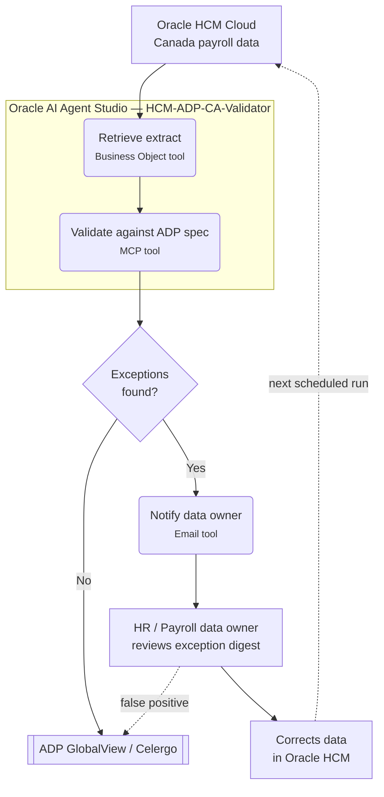

# Architecture — Fortive Oracle HCM → ADP Celergo Data Validation Agent

## Target end-state (Oracle AI Agent Studio, Canada MVP)

```
Oracle HCM Cloud (Canada LDG)
      |
      | 1. HCM Extract / OTBI report (scheduled, e.g. nightly pre-payroll cutoff)
      v
Staging area (OCI Object Storage bucket or Oracle Integration Cloud (OIC) instance)
      |
      | 2. Agent trigger: scheduled job or OIC integration event
      v
Oracle AI Agent Studio Agent  ("HCM-ADP-CA-Validator")
  - Tool (Business Object): get_hcm_extract       -> reads Oracle HCM directly
  - Tool (MCP):             validate_against_spec -> runs ADP Canada rule catalog, returns exceptions
  - Tool (Email):           send_notification      -> emails HR/data owner digest
  - Knowledge: ADP Celergo Canada interface control document (ICD),
               Fortive pay group / earnings code reference
      |
      | 3. Exceptions found -> email digest per data owner
      v
HR / Payroll Data Owner (human-in-the-loop review + remediation in Oracle HCM)
      |
      | 4. Corrected data flows through the existing HCM -> ADP interface on the
      |    next scheduled run (agent does NOT auto-correct or transmit data)
      v
ADP GlobalView / Celergo
```

Key design decision from the requirement: this is **detect-and-flag only**.
The agent never edits HCM data and never blocks or modifies the existing
Oracle-to-ADP transmission — it runs alongside it and raises exceptions early
enough for a human to fix the source data before the real interface runs.

Same flow, rendered as a diagram:



## Component mapping: wireframe -> Oracle AI Agent Studio

| Wireframe (this repo)              | Real Oracle AI Agent Studio component |
|-------------------------------------|----------------------------------------|
| `data/sample_hcm_extract_canada.csv` | Oracle HCM Canada payroll data, read live via a **Business Object** tool (no staging needed for the demo data path) |
| `src/rules.py` rule catalog          | Agent Knowledge (ADP Celergo Canada ICD) + the `validate_against_adp_spec` MCP tool, which runs the same checks |
| `src/validator.py` + `mcp_server/server.py` | The `validate_against_adp_spec` **MCP** tool — a working MCP server in this repo, registered in Studio's Tools tab via Tool Type "MCP" |
| `src/email_notifier.py`              | The `send_notification_email` **Email** tool (native Fusion tool type) — no custom hosting needed |
| `main.py` orchestration              | The Agent's instructions/workflow: "retrieve extract -> validate -> if exceptions, notify" |
| `tests/test_validator.py`            | Regression pack to re-run whenever the ADP spec or pay group config changes |

## Canada MVP scope boundaries (de-risking)

- One legislative data group (Canada) only; no US/other country pay groups in scope.
- Read-only: agent has no write access to Oracle HCM or to the ADP interface.
- Email is the only notification channel (no Teams/Slack/ticketing integration in MVP).
- Exception routing keyed on province -> data owner mapping (placeholder table in
  `src/email_notifier.py`, to be replaced with Fortive's actual RACI).
- Rule catalog is a placeholder built from generically known ADP Celergo Canada
  field requirements (SIN, province, banking, TD1, pay group/frequency, effective
  dating). **Must be validated against Fortive's actual ADP interface control
  document before this becomes anything more than a demo.**
